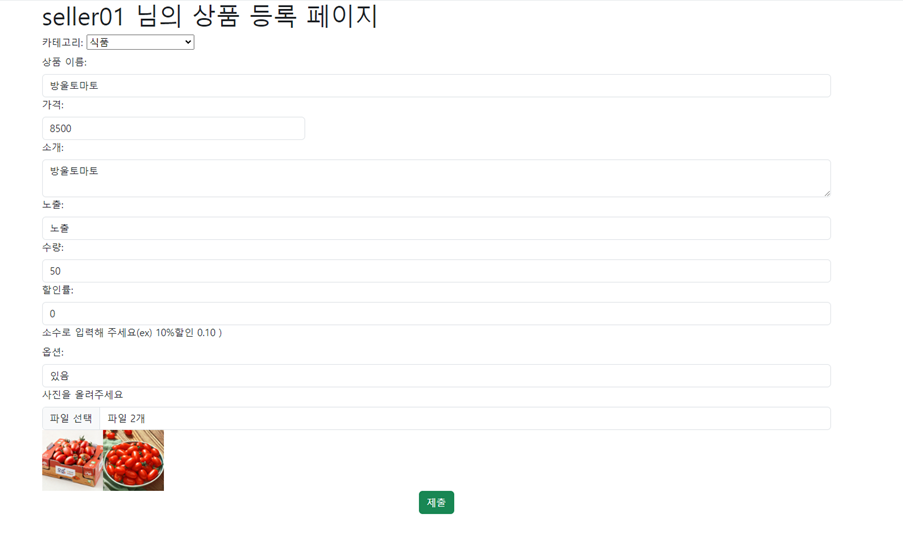
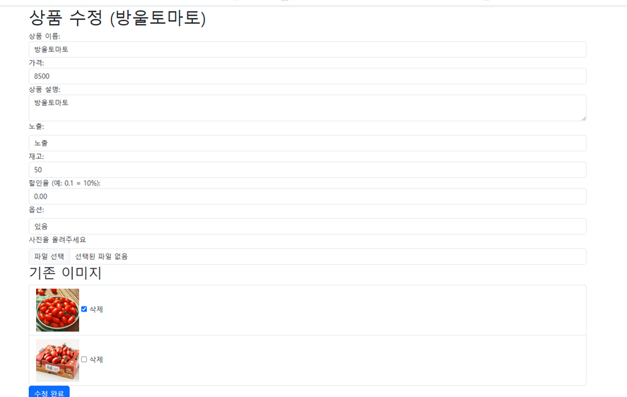
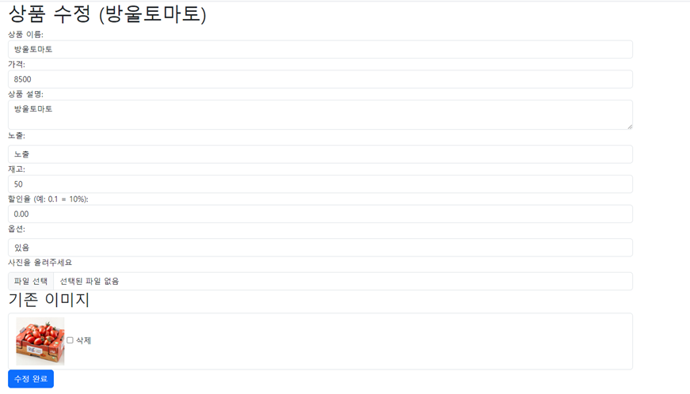
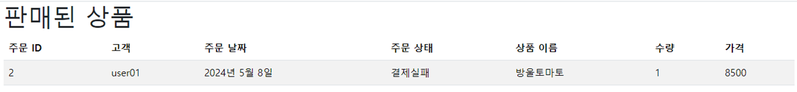

# e-commerce
## 브랜치 정보
## user_test(송용진) : 유저 관련 기능
## seller-jaeheon(양재헌) : 구매자 관련 기능
## payment-dev(김연희) : 구매자 관련 기능
## cart(이승희) : 장바구니 기능
## LGM(이경민) : 판매자 관련 기능
1. 상품 등록

2. 등록한 상품 리스트

3. 상품 수정(내용 및 이미지 추가, 삭제)

4. 구매자 주문 시 주문 목록
 
