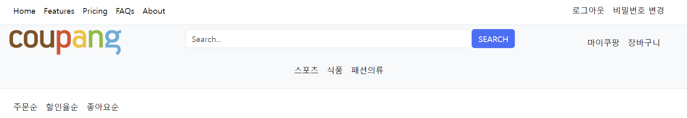
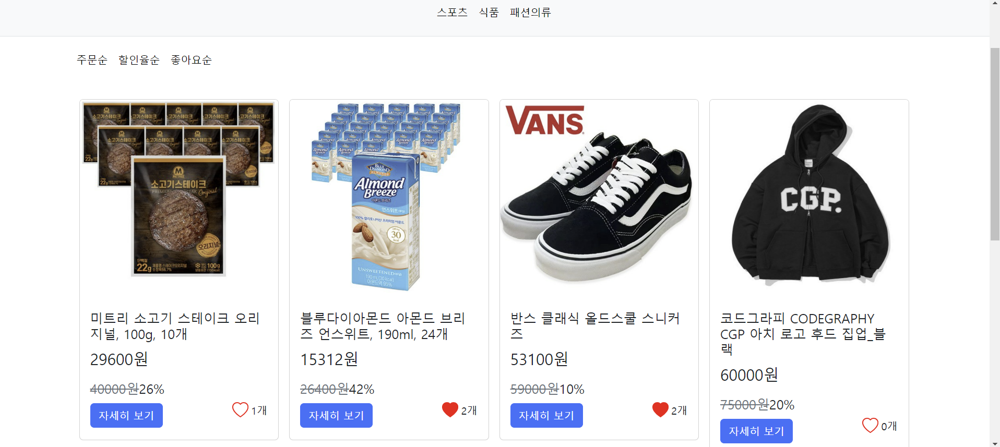
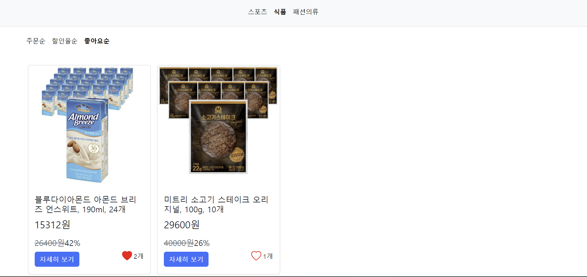
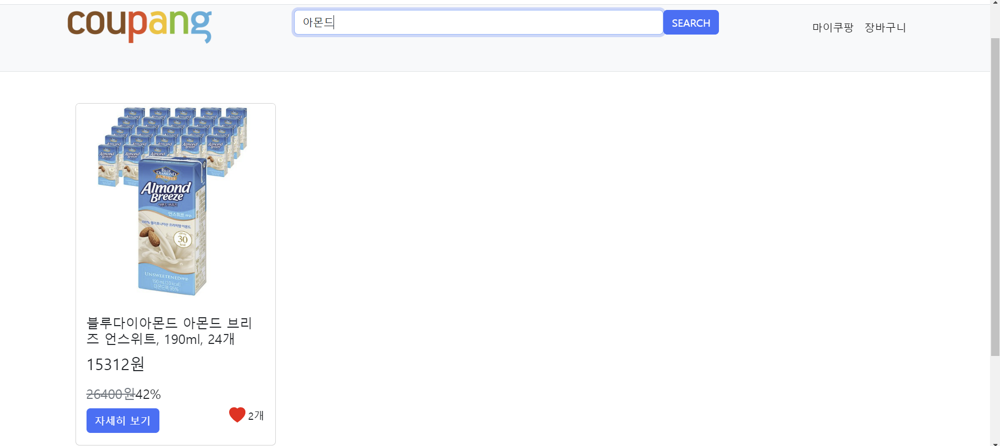

# e-commerce
## 브랜치 정보
## user_test(송용진) : 유저 관련 기능
## seller-jaeheon(양재헌) : 구매자 관련 기능
## payment-dev(김연희) : 구매자 관련 기능
## cart(이승희) : 장바구니 기능
## LGM(이경민) : 판매자 관련 기능

## 양재헌
1. base.html,home.html 등 기본 html작성

2. 첫 화면에 보이는 상품들 정렬

3. 카테고리에 따라 상품들 분류
4. 할인율순,주문순,좋아요순으로 특정 기준으로 상품들 정렬
5. 하트 이미지와 함께 좋아요 기능을 구현

6. 검색기능

