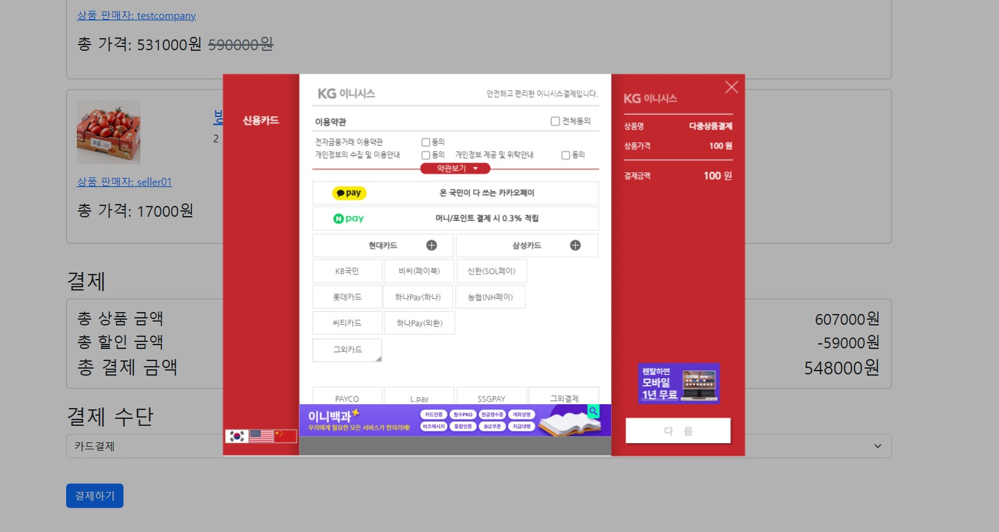

# e-commerce
## 브랜치 정보
## user_test(송용진) : 유저 관련 기능
## seller-jaeheon(양재헌) : 구매자 관련 기능
## payment-dev(김연희) : 구매자 관련 기능
## cart(이승희) : 장바구니 기능
## LGM(이경민) : 판매자 관련 기능
1. 상품 등록

2. 등록한 상품 리스트

3. 상품 수정(내용 및 이미지 추가, 삭제)

4. 구매자 주문 시 주문 목록
 

## 양재헌
1. base.html,home.html 등 기본 html작성

2. 첫 화면에 보이는 상품들 정렬

3. 카테고리에 따라 상품들 분류
4. 할인율순,주문순,좋아요순으로 특정 기준으로 상품들 정렬
5. 하트 이미지와 함께 좋아요 기능을 구현

6. 검색기능

## 김연희
---
### 1. 상품 상세보기 페이지

#### 할인
- 할인 없는 상품 : 상품 가격 출력
- 할인 있는 상품 : 할인가 및 할인율 안내

#### 재고확인
수량 버튼(-,+)은 1개부터 상품재고 수량 내에서만 활성화 됨

#### 제품 이미지
- 제품 사진 자동으로 넘어감
- 사진 하단의 바 또는 사진 좌우를 클릭하여 상품 사진 전환 가능

---
### 2. 상품 구매/결제 페이지
! 로그인하지 않은 사용자가 바로구매를 누르면 로그인 화면이 나오고, 그 후 자동으로 주문페이지로 넘어감

#### 전화번호 유효성 검사

#### 주소검색 및 자동입력
배송 정보란에 구매자의 정보가 기본값으로 들어가 있음

#### 결제 화면

---
### 3. 주문/결제 처리 과정

- 고객이 주문서를 작성하고 주문하기 버튼을 누른 후 진행됨
- 각 단계가 하나의 트랜잭션임 (1,2,3 단계)
- 3단계의 상품 재고 수정 부분에서 동시성 처리함

| 단계 | 설명   | 성공후  주문상태 |실패 시나리오   | 실패후 주문상태    | 안내화면 | 
|------|--------|------------------|---------------|------------|-------------| 
| 1.   | 주문 정보를 데이터베이스에 저장 | 주문중         | <li>재고 부족 : 재고 부족 안내(알림창)    <li>데이터 오류 : 데이터 오류로 인한 주문실패 안내(알림창) |       |    |
| 2.   | PG사 결제(KG이니시스) | 주문중         | <li>결제 오류 : 결제 실패 이유 안내(주문실패 페이지) | 결제실패 |   |
| 3.   | 결제 정보를 데이터베이스에 저장 & 상품 재고 수정 | 결제완료   | <li>재고 부족 : 재고 부족으로 인한 환불 안내(알림창)    <li>데이터 오류 : 데이터 오류로 인한 환불 안내(주문실패 페이지) | 환불대기  |    |
| 성공   | 주문/결제 정보 요약안내(주문 성공 페이지)  |     |             |       |   |
---